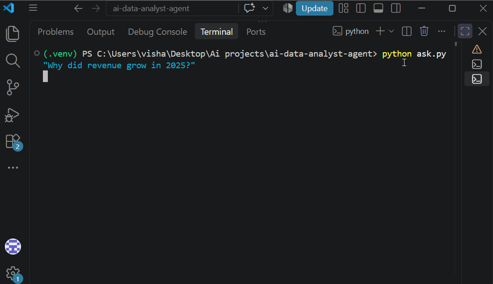
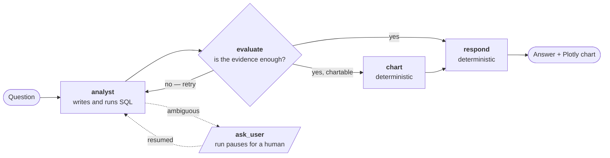

<h1 align="center">AI Data Analyst Agent</h1>

<p align="center">
  <b>Answers business questions about a PostgreSQL database — writes its own SQL,<br/>
  reviews its own evidence, and asks before it guesses.</b>
</p>

<p align="center">
  
  
  
  
  
  
  
  
</p>

<!-- Record this before pushing, or delete the line. A broken image here is worse than none. -->
<p align="center"></p>

<p align="center">
<b>6/7</b> answer accuracy &nbsp;·&nbsp; <b>7/7</b> within query budget &nbsp;·&nbsp; <b>~$0.0009</b> per analysis &nbsp;·&nbsp; <b>20.3s</b> median &nbsp;·&nbsp; <b>0</b> writes possible
</p>

---

## What it does

Ask *"why did revenue grow in 2025?"* and it runs a loop: write SQL, read the rows,
decide whether the evidence actually supports a conclusion, run more SQL if it doesn't,
then answer in business language with a chart.

```
$ python ask.py "Why did revenue grow in 2025?"

[sql] SELECT EXTRACT(YEAR FROM o.order_date), SUM(oi.quantity * oi.unit_price * ...
[sql] SELECT c.category_name, SUM(...) FROM order_items oi JOIN products p ...
2 queries, 2 analyst pass(es)

=== ANSWER ===
Revenue rose $270,003 (13.2%) to $2,315,167 in 2025. Electronics was the engine:
$911,266 → $1,059,796, contributing $148,530 of the $270,003 increase. Every other
category grew, but none added more than $50k individually.
```

### It is not a text-to-SQL wrapper

A wrapper turns one question into one query and prints the rows. Five things here don't
fit that description:

| | |
|---|---|
| **Chooses its own tools** | Nothing hard-codes which query runs. The model decides whether it needs the schema, one query, or four |
| **Recovers from its own errors** | Database errors are returned to the model *as text*, so bad SQL gets corrected instead of crashing the run |
| **Judges its own work** | A reviewer node reads the SQL that ran and the answer that was written, and sends the run back when the evidence doesn't support the claim |
| **Stops to ask a human** | "Revenue in March" across three years of data pauses the graph mid-run and waits for an answer |
| **Bounded** | Hard caps on model calls, tool calls and clarifying questions, so a confused run ends instead of looping |

## Try it — two commands

```bash
docker compose up --build
docker compose exec api python -m app.database.seed
```

Postgres builds its own schema and read-only role on first boot. Then open
**http://localhost:8000/docs**.

---

## Architecture



| Node | What it does | Model call? |
|---|---|---|
| **analyst** | LangChain agent with 4 tools: `list_tables`, `describe_tables`, `run_sql`, `ask_user`. Schema and the data's real date range are already in its prompt, so it doesn't waste turns rediscovering them | yes |
| **evaluate** | A smaller model returns a **typed Pydantic object** — `sufficient`, `gaps`, which query to chart. No text parsing. Caps retries so a stubborn question ends | yes |
| **chart** | Re-runs the chosen query, finds the numeric column with pandas, returns Plotly JSON | **no** |
| **respond** | Walks back for the last real answer, with a fallback if a limit was hit mid-run | **no** |

State is a `TypedDict` with reducers — `messages` accumulates across turns, `queries`
uses a custom reducer where `None` clears the list so one turn's SQL never leaks into
the next. A checkpointer saves state after every node, which is what makes memory,
mid-run pausing and HTTP resumption **the same mechanism**.

---

## Safety: the agent cannot write, by two independent routes

It generates SQL and executes it. That is only acceptable with guarantees that don't
depend on the model behaving.

| Layer | Stops |
|---|---|
| **sqlglot parse check** | Anything that isn't exactly one `SELECT` — including a write hidden inside a CTE, which a regex misses |
| **Read-only Postgres role** | `SELECT` only, plus `default_transaction_read_only = on`. A bug in the validator still can't write |
| **Statement timeout** | A runaway query is killed by the database, not left to hang |
| **Row cap** | Results capped, with a flag when output was truncated |

Verified end-to-end — this is Claude Desktop, through the MCP server, trying to delete:

```
> DELETE FROM orders
Query rejected: Only SELECT queries are allowed.
```

---

## Evaluation

A LangSmith dataset where **every expected answer was verified by querying Postgres
directly** — not estimated, not model-generated.

| Metric | Result |
|---|---|
| Answer accuracy | **6 / 7** |
| Stayed within its 5-query budget | **7 / 7** |
| Median latency | **20.3 s** |
| Cost per analysis | **~$0.0009** (26,055 tokens for a 7-question run) |

```bash
python evaluate_agent.py
```

Two deterministic evaluators — one checks the expected facts appear, one checks query
budget adherence. **No LLM judge, on purpose**: the ground truth is computable, so a
judge would add cost and non-determinism for nothing. A judge earns its place when
correctness isn't checkable, like grading tone.

**What evaluation caught.** Baseline was 5/7.

- **A real bug** — asked about a period outside the data, it answered *"the query
  returns NULL"* instead of explaining the data ends 2026-08-31. Tightened the rule,
  re-ran, fixed. Measured before and after.
- **A bug in my test** — true revenue is `2,045,164.62`; the agent correctly rounded to
  `2,045,165`; my expected value had truncated to `...164`. The agent was right.

Telling those two apart is the skill the step was worth having.

**Honest limitation.** One check is still phrasing-sensitive. Three runs of the same
question produced *"2026-08-31"*, *"NULL"*, and *"the latest order is dated…"* — all
correct, all worded differently. Exact string matching measures formatting, not
correctness. The robust fix is numeric parsing with tolerance or a semantic judge; both
were skipped to keep evaluation deterministic and nearly free.

---

## Three interfaces, one safety layer

```bash
python ask.py "Why did revenue grow in 2025?"          # CLI
```

**HTTP API** — human-in-the-loop over a *stateless* protocol. `input()` can't exist over
HTTP, so the interrupt becomes a response and the `thread_id` becomes the resume token:

```jsonc
POST /ask  { "message": "Why did revenue drop in March?" }
→ { "status": "needs_input", "thread_id": "9f2c…",
    "agent_question": "Which year's March?" }

POST /ask  { "message": "2024", "thread_id": "9f2c…" }
→ { "status": "answer", "answer": "…", "queries": [...], "chart": {…} }
```

Send the same `thread_id` with a follow-up and the conversation continues — the same
checkpointer that makes pausing work.

**MCP server** — 29 lines exposing the database over the Model Context Protocol, so any
MCP client (Claude Desktop, Cursor, MCP Inspector) can query it. It reuses the same
`run_query` path, so the validator and read-only role cover it too. Three front doors,
one place where safety lives.

<details>
<summary>Registering it with Claude Desktop (Microsoft Store gotcha)</summary>

On Store installs, `claude_desktop_config.json` lives under
`%LOCALAPPDATA%\Packages\Claude_*\LocalCache\Roaming\Claude\`, **not** `%APPDATA%\Claude\`,
which every tutorial says. Settings → Developer → Edit config opens the correct one.
</details>

---

## Engineering decisions

| Decision | Why | Rejected |
|---|---|---|
| One agent + a reviewer node | The review is a *step*, not a personality. Cheaper, debuggable, no inter-agent protocol to get wrong | Multi-agent crew |
| `chart` and `respond` take no model call | They're mechanical. A model there adds latency, cost and a failure mode for nothing | LLM-everything |
| Reviewer returns typed Pydantic | A typed decision can be routed on; prose has to be parsed and can be wrong in new ways each time | Parsing free text |
| Limits live in middleware | The prompt said "ask once" and the model asked twice. **A prompt is a request; middleware is a guarantee** | Prompt-only rules |
| Provider isolated in `app/core/llm.py` | A model was retired mid-build; the fix was one line | Scattered client calls |
| Raw psycopg cursor | SQLAlchemy's `text()` reads `:` in JSON as a bound parameter; `exec_driver_sql` reads `%` in `LIKE` as a placeholder. Only the raw cursor survives both | ORM convenience |
| Generated dataset, fixed seed | The answers are known in advance, so reasoning can be checked against ground truth instead of judged on plausibility | A Kaggle download |

---

## What went wrong while building it

The slow parts, because that's usually the useful half.

- **A dependency was sunset mid-build.** `langchain-community` disappeared. Replaced with thin `@tool` wrappers over my own functions — fewer moving parts, and tool docstrings became the real interface to the model.
- **A model was retired mid-build.** `llama-3.3-70b-versatile` left the free tier. One line in `.env`, because the provider lives in exactly one file.
- **SQLAlchemy kept mangling valid SQL.** `text()` and `exec_driver_sql` each broke on different characters the model legitimately generates. Only the raw driver cursor survives both — caught by a test.
- **A test passed for the wrong reason.** It asserted `DatabaseError` on a write — and passed while Postgres was switched off entirely. Fixed by asserting on the message, not the type.
- **The agent fired ten queries on one question.** Schema in the prompt plus an explicit query budget brought it to two.
- **It reported future months as zero revenue.** The prompt now carries the data's real date range — and evaluation then caught the follow-up case where it said "NULL" instead.
- **It asked the same clarifying question twice.** The prompt already forbade it. Moving the constraint to a per-tool call limit made it enforcement instead of a request.

---

## Repo map

```
app/
  agent/      analyst · evaluator · graph · state · charts · tools
  core/       config · llm            ← the only provider-specific file
  database/   schema.sql · roles.sql · safety.py · connection.py · seed.py
  api/        FastAPI service
ask.py                CLI
mcp_server.py         MCP server
evaluate_agent.py     LangSmith evaluation
tests/                safety validator + graph routing
docker-compose.yml    API + Postgres, schema and role created on first boot
```

## The dataset

Generated deterministically from a fixed seed — **800** customers · **120** products ·
**12,603** orders · **34,342** units · **2024-01-01 to 2026-08-31**.

Generated rather than downloaded for one reason: **the answers are known in advance.**
Real patterns are planted — Electronics growth driving the 2025 increase, among others —
so the agent's *reasoning* can be checked against ground truth instead of judged on
whether it sounds plausible. That is what makes the evaluation above mean anything.

## Running locally

```bash
pip install -r requirements.txt
cp .env.example .env          # add your keys
python -m app.database.seed
python ask.py "What was the total revenue in 2025?"
pytest -q
```

Tests cover the deterministic parts — the SQL validator (including CTE-hidden writes,
and a live check that the read-only role really refuses) and the routing function that
decides whether the graph loops, charts or answers. They never call the model; model
behaviour is measured in LangSmith instead, because the same question gets
differently-worded answers each run — exactly the thing that must stay out of a test
suite.

## Limitations

- **Latency** — 20 s for simple questions, 1–3 min for multi-query ones. It's a loop over a slow API, not a dashboard.
- **In-memory checkpointer** — conversations don't survive a restart and don't span workers. The fix is the Postgres checkpointer: a one-line change, deliberately not made here.
- **Read-only, single database** by design. No writes, no joins across sources.
- **Free-tier rate limits** — concurrent requests can hit the provider's tokens-per-minute cap.
- **One evaluation check is phrasing-sensitive**, as described above.
- The Postgres password in `docker-compose.yml` is a **local development credential**; that port isn't published outside the Docker network. A real deployment injects it as a secret.

---

<p align="center">
Python 3.13 · LangChain · LangGraph · Groq · PostgreSQL · SQLAlchemy + psycopg3 · sqlglot<br/>
Pydantic · pandas · Plotly · FastAPI · MCP · LangSmith · Docker Compose · pytest
</p>

<p align="center"><sub>The LLM provider is isolated in <code>app/core/llm.py</code> — switching providers is one file and two environment variables.</sub></p>
