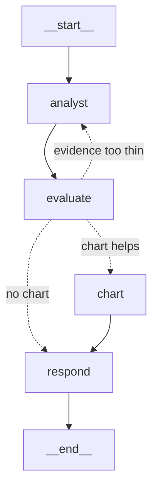

# AI Data Analyst Agent

An AI agent that answers business questions about a PostgreSQL e-commerce database.
It inspects the schema, writes and runs read-only SQL, judges whether its own evidence
is sufficient, runs more queries when it isn't, and explains the result in business
terms with a chart.

> **"Why did revenue drop in March 2026?"**
>
> Revenue fell from $174,369 in February to $141,646 in March, a drop of $32,723 (-18.8%).
> Electronics fell from $84,231 to $41,473, a loss of $42,758 — larger than the total
> decline, since other categories grew slightly. Order volume was flat (377 → 378), and
> Electronics units halved (180 → 90) while average price moved 1%. So the cause is
> product mix, not traffic.

That answer took four queries. The agent chose all of them.

---

## Why this is an agent, not a Text-to-SQL wrapper

A Text-to-SQL tool maps one question to one query. This decides how deep to go based on
what it finds.

The dataset contains a deliberate trap: in March 2026, **order count is flat while revenue
drops 19%**. A single query on order volume concludes "nothing changed" — and is wrong.
The real cause only appears in the second and third query.

| Pipeline | This project |
|---|---|
| question → SQL → rows | question → plan → query → **read result** → decide → query again → explain |
| Fixed number of queries | 1 for a simple lookup, 4–7 for a "why" question |
| Answer is a table | Answer names the driver, with the numbers behind it |

---

## Architecture



### How one question flows through it

1. **analyst** — a LangChain `create_agent` with three tools (`list_tables`,
   `describe_tables`, `run_sql`). The model writes SQL, reads the rows, and decides
   whether it needs another query. The schema and the data's date range are in the
   system prompt, so it doesn't waste calls discovering them.
2. **evaluate** — one structured-output call returns a typed object:
   `sufficient`, `gaps`, and a chart decision. It asks whether the queries actually
   support the answer — for a "why" question, whether a breakdown was run at all.
3. **conditional edge** — if the evidence is thin, the graph routes **back to the
   analyst** with the specific missing query named. Capped at 2 passes.
4. **chart** — deterministic Python. The evaluator picks *which* query, *what type*
   and a title; pandas and Plotly do the drawing. The model never writes chart code.
5. **respond** — assembles the answer, the chart and the SQL that ran. No model call.

### Who does what

| Layer | Responsibility |
|---|---|
| **LangChain** | The inner tool loop: think → call tool → read result → repeat |
| **LangGraph** | The outer workflow: state, evidence review, the retry cycle, the chart branch |
| **Python** | Everything that must be deterministic: SQL validation, execution, charts |

The distinction that matters: LangChain's loop lets the agent grade its own work.
The evaluator is a **separate node with its own prompt and a hard retry cap**, which
is why it catches what the agent misses.

---

## SQL safety

The agent generates SQL, so the question isn't whether it will eventually write something
destructive — it's what happens when it does. Four layers, strongest first:

| Layer | Mechanism | Can an LLM bypass it? |
|---|---|---|
| 1. Database role | `analyst_readonly`, `SELECT` only, `default_transaction_read_only = on` | **No** |
| 2. Validator | sqlglot parses the query and walks the tree | No |
| 3. Limits | Row cap, `statement_timeout = 15s` | No |
| 4. System prompt | Instructions | Yes — which is why it's last |

Layer 2 walks the **whole parse tree**, because a write can hide inside a read:

```sql
WITH x AS (DELETE FROM orders RETURNING *) SELECT * FROM x
```

That starts with `WITH` and ends with `SELECT`. A check on the first keyword passes it.

The test suite proves each layer separately. One test deliberately **bypasses the
validator** and fires `DELETE` straight at the database:

```
sqlalchemy.exc.InternalError: cannot execute DELETE in a read-only transaction
```

Security that doesn't depend on my own code being bug-free.

---

## The database

Five tables, seeded from a fixed random seed so the data is identical on every machine.

```
customers(customer_id, customer_name, email, region, signup_date)
categories(category_id, category_name)
products(product_id, product_name, category_id, unit_price)
orders(order_id, customer_id, order_date, status)
order_items(order_item_id, order_id, product_id, quantity, unit_price, discount_pct)
```

800 customers · 120 products · 12,603 orders · 24,307 order items · Jan 2024 – Aug 2026

**Revenue** = `SUM(quantity * unit_price * (1 - discount_pct))` where `status = 'completed'`.
The definition also lives in a PostgreSQL `COMMENT ON` so the agent reads it from the
schema rather than guessing.

### Patterns planted on purpose

The data is synthetic **so that correct answers are known**. Without ground truth there's
no way to evaluate whether the agent is right or merely confident.

| Pattern | Truth |
|---|---|
| March 2026 dip | 141,646 vs 174,369 in Feb — driven by Electronics, **not** by order volume |
| Electronics collapse | 180 units → 90; price flat |
| Highest average order value | West (~688) vs 477–488 elsewhere |
| Fast-growing customers | 8 customers with far higher 2026 spend |
| Seasonality | Nov/Dec peak, Jan/Feb trough; 2024 → 2025 growth +13% |

---

## Setup

```bash
git clone https://github.com/vishalprajapat18/ai-data-analyst-agent.git
cd ai-data-analyst-agent

python -m venv .venv
.venv\Scripts\Activate.ps1        # Windows
pip install -r requirements.txt

cp .env.example .env               

Create the database (`analytics`) in PostgreSQL, then:

```bash
python -m app.database.seed                  # schema + data
# run app/database/roles.sql once as an admin user
python -m pytest -q                          # 6 safety tests
python ask.py "Why did revenue drop in March 2026?"
```

---

## Example questions

| Question | Behaviour |
|---|---|
| "What was the total revenue in 2025?" | 1 query, no chart |
| "Show monthly revenue in 2026" | 1 query, line chart |
| "Why did revenue drop in March 2026?" | 4–7 queries across 2 passes, category and volume breakdown |
| "Which region has the highest average order value?" | 2 queries, bar chart |

---

## What went wrong while building it

The failures were more instructive than the successes.

**The agent invented a business conclusion.** It reported September–December 2026 revenue
as $0 and concluded there had been no sales. The dataset simply ends on 31 August. Fixed
by querying `MIN/MAX(order_date)` at startup and putting the coverage in the prompt. It
now writes *"no data — the source data ends on 2026-08-31, not because revenue fell to zero."*
A query returning zero does not mean the real-world value is zero.

**Call limits were ordered wrongly.** The tool-call limit was 15 and the model-call limit
12. Every tool call needs a model call first, so the model limit always fired first and
runs ended with no answer at all. Now 8 tools / 16 models, and `respond` never shows a
limit message to the user.

**It over-queried badly.** Ten queries for "show monthly revenue", including five
near-identical CTEs. Putting the schema in the prompt and adding a query budget brought
that to **two**.

**Prompt wording sets the default.** The chart rule phrased as "use -1 when a chart isn't
useful" produced no charts at all. Rephrased as "most analyses deserve one; use -1 only
for a single number", charts appeared.

---

## Status

Built: database and seed · read-only role and SQL guardrails · LangChain agent and tools ·
LangGraph workflow · evidence evaluator with retry loop · Plotly charts · LangSmith tracing

Next: conversation memory · clarifying questions (human-in-the-loop) · FastAPI · MCP
server · LangSmith evaluation suite · Docker

## Limitations

- Synthetic data. Realistic in shape, but not real customers.
- A hard "why" question takes 1–3 minutes on Groq's free tier.
- Evidence review is capped at two passes; a very deep question can still stop early.
- Charts are line and bar only, by design — enough to be useful, small enough to be safe.